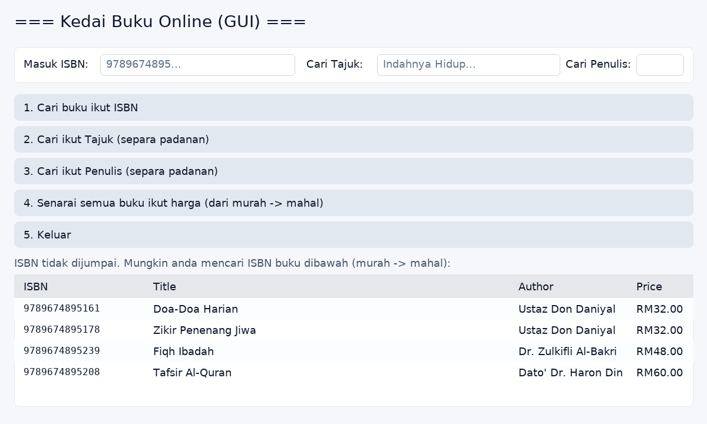

# 📚 Kedai Buku Python

Skrip **Kedai Buku Python** untuk belajar asas carian & pengurusan data buku — ada versi **CLI (terminal)** dan **GUI (Tkinter)**.  
Data: 100 ISBN buku Melayu dengan harga realistik.

## 🎯 Fungsi
- Cari buku **ikut ISBN (13 digit)** — jika tak tepat, beri **cadangan ISBN hampir sama** *(murah → mahal)*.
- Cari **ikut Tajuk** *(separa padanan, case-insensitive)*.
- Cari **ikut Penulis** *(separa padanan, case-insensitive)*.
- Senarai buku **ikut harga** *(murah → mahal)* menggunakan **Merge Sort**.
- Jadual **auto-resize** (CLI) & **UI profesional** (GUI).

## 🛠 Teknologi
- Python 3.x
- Standard library sahaja: `tkinter`, `dataclasses` (opsyenal untuk versi console), `shutil`, `os`.

## 📂 Struktur
```
.
├── bookstore.py         # Versi CLI (terminal)
├── bookstore_gui.py     # Versi GUI (Tkinter)
├── book_data.py         # 100 ISBN buku Melayu
└── assets/
    ├── screenshot-found.png     # Contoh output CLI - jumpa
    ├── screenshot-suggest.png   # Contoh output CLI - cadangan
    └── gui-preview.png          # Pratonton GUI
```

## 🚀 Cara Jalankan
**CLI**
```bash
python bookstore.py
```

**GUI**
```bash
python bookstore_gui.py
```

## 🖼️ Tangkapan Skrin

**GUI Preview**  


**CLI – Carian berjaya (ISBN tepat)**  


**CLI – Cadangan bila ISBN tak dijumpai (murah → mahal)**  


## 🧱 Data Struktur
- Versi console boleh guna `@dataclass Book` — field: `isbn: int`, `title: str`, `author: str`, `price: float`.
- `book_data.py` simpan senarai dict; boleh convert → `Book` dalam skrip utama jika mahu lebih kemas.

## 🧮 Complexity (Big‑O)
| Komponen                           | Masa           | Ruang | Nota |
|------------------------------------|----------------|-------|------|
| Merge Sort (sort harga)            | O(n log n)     | O(n)  | Stabil; sesuai data besar |
| Binary Search (cari ISBN tepat)    | O(log n)       | O(1)  | Perlu data **sorted by ISBN** |
| Cadangan (prefix/nearest + sort)   | O(n) → O(n log n) | O(1)/O(n) | Scan/prefix; nearest + ranking top 5; sort harga untuk paparan |

## 📜 Lesen
MIT — bebas guna & ubah suai.
